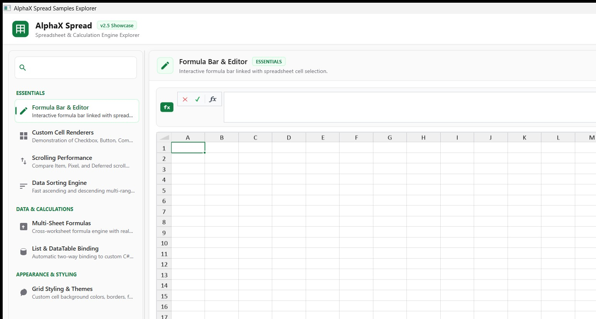

# AlphaX.Sheets - High-Performance WPF Spreadsheet & Calculation Engine

[](https://github.com/kartikdeepsagar/AlphaX.WPF.Sheets)
[](https://dotnet.microsoft.com/)
[](https://dotnet.microsoft.com/)
[](LICENSE)

**AlphaX.Sheets** is a modular, high-performance, Excel-like spreadsheet component for WPF applications. It combines a platform-agnostic core spreadsheet data engine, a multi-sheet calculation engine (`AlphaX.CalcEngine`), and a modern WPF view control (`AlphaXSpread`) featuring an Excel-inspired Material 3 aesthetic and multi-target support for **.NET 10.0** and **.NET Framework 4.7.2**.



---

## ✨ Features at a Glance

- 🚀 **High Performance Grid**: Virtualized rendering supporting smooth navigation and virtual scrolling across 50,000+ data rows.
- ⚡ **Multi-Targeted .NET 10 & .NET Framework**: Built for modern **.NET 10** performance optimizations while preserving legacy **.NET Framework 4.7.2** compatibility.
- 🧮 **Multi-Sheet Calculation Engine**: Cross-worksheet formula dependencies with real-time recalculation engine powered by `AlphaX.CalcEngine`.
- 🎨 **Materialist & Modern Theme**: Excel Green (`#107C41`) accent styling, light-slate surface palette, customizable gridlines, headers, and row striping.
- 📊 **Two-Way Data Binding**: Native binding to C# POCO collections (`List<T>`) and ADO.NET `DataTable` objects.
- 🔘 **Rich Custom Cell Renderers**: Built-in renderers for Checkbox, Button, ComboBox, Hyperlink, and Text cells.
- 🔃 **Range Sorting Engine**: Multi-column ascending and descending sorting algorithms.
- 📜 **Configurable Scroll Modes**: Support for **Item**, **Pixel**, and **Deferred** scroll modes.

---

## 🏗️ Architecture & Multi-Targeting

The project is architected with strict separation of concerns into multi-targeted assemblies:

```
src/
├── AlphaX.Sheets/              # Core data engine (netstandard2.0;net10.0)
├── AlphaX.CalcEngine/          # Expression parser & calculation engine (netstandard2.0;net10.0)
├── AlphaX.WPF.Sheets/          # WPF UI control (net472;net10.0-windows)
└── Samples/                    # Modern Samples Explorer application (net472;net10.0-windows)
```

| Assembly | Target Frameworks | Target Audience |
| :--- | :--- | :--- |
| **AlphaX.Sheets** | `netstandard2.0;net10.0` | Platform Agnostic Core Engine |
| **AlphaX.CalcEngine** | `netstandard2.0;net10.0` | Formula Evaluation Engine |
| **AlphaX.WPF.Sheets** | `net472;net10.0-windows` | Modern & Legacy WPF Control |
| **Samples Explorer** | `net472;net10.0-windows` | Showcase & Benchmark App |

---

## 🚀 Getting Started

### 1. Adding `AlphaXSpread` to XAML

```xaml
<Window x:Class="SpreadDemo.MainWindow"
        xmlns="http://schemas.microsoft.com/winfx/2006/xaml/presentation"
        xmlns:x="http://schemas.microsoft.com/winfx/2006/xaml"
        xmlns:sheets="http://schemas.gcspreadsheet.com/2022/wpf"
        Title="AlphaX Spreadsheet Demo" Height="600" Width="900">
    <Grid>
        <Grid.RowDefinitions>
            <RowDefinition Height="Auto"/>
            <RowDefinition Height="*"/>
        </Grid.RowDefinitions>

        <!-- Formula Bar -->
        <sheets:AlphaXFormulaTextBox Margin="8" Spread="{Binding ElementName=spreadControl}"/>

        <!-- Main Spreadsheet Control -->
        <sheets:AlphaXSpread x:Name="spreadControl" Grid.Row="1"/>
    </Grid>
</Window>
```

### 2. Data Binding Example

```csharp
using AlphaX.Sheets.Data;

// Bind a List<Customer> to the active worksheet
var customers = GetCustomerList();
var worksheet = spreadControl.WorkBook.WorkSheets.GetSheet(0);

worksheet.DataSource = customers;
worksheet.Columns[0].DataMap = new PropertyDataMap("Id");
worksheet.Columns[1].DataMap = new PropertyDataMap("FirstName");
worksheet.Columns[2].DataMap = new PropertyDataMap("LastName");
worksheet.Columns[3].DataMap = new PropertyDataMap("Email");
```

---

## 💻 Samples Explorer

Run `AlphaXSpreadSamplesExplorer.csproj` to explore interactive feature demonstrations:

- **Formula Bar & Editor**: Real-time formula editing linked to spreadsheet cell selection.
- **Multi-Sheet Formulas**: Cross-sheet formula evaluation with real-time dependency recalculations.
- **Data Binding**: Compare POCO `List<T>` vs. ADO.NET `DataTable` two-way bindings.
- **Grid Styling & Themes**: Live theme switcher (Slate, Excel Classic Green, Emerald, Indigo, Corporate) and 4-quadrant grid showcase.
- **Scroll Modes**: Benchmark performance under 50,000+ data rows with Item, Pixel, and Deferred scroll modes.

---

## 🤝 Contributing

Contributions are welcome! Feel free to open issues, submit pull requests, or propose new spreadsheet features and calculation engine capabilities.

## 📄 License

This project is licensed under the [MIT License](LICENSE).
